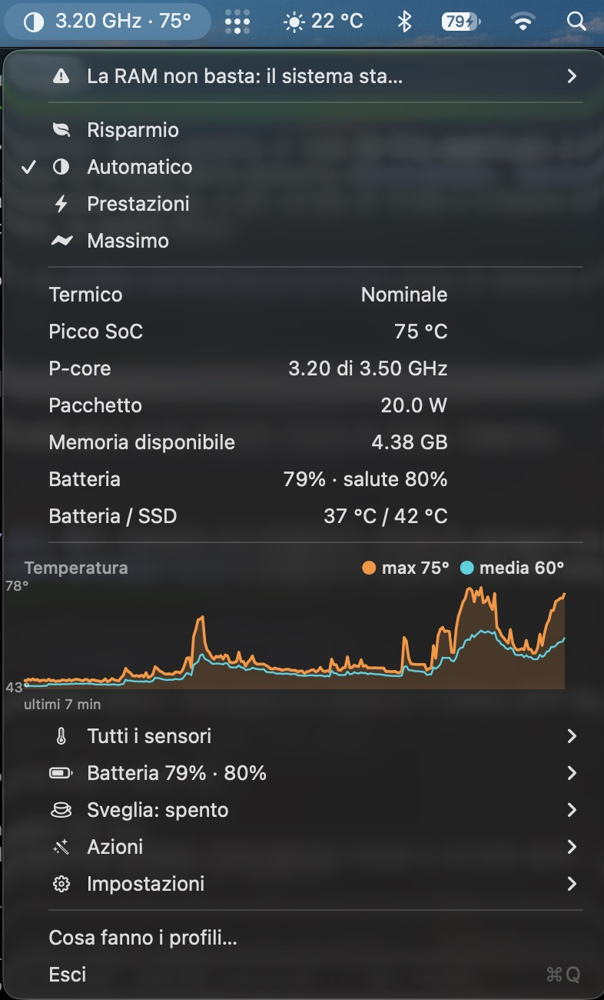

<div align="center">

# ⚡ Watt

**Open-source thermal monitor and power profiles for fanless Apple Silicon Macs.**

Tells you when your Mac is throttling — and by how much —
instead of letting you find out by waiting.


[Italiano](README.it.md) · [andreapiani.com](https://andreapiani.com) · [Installation](#installation) · [Benchmarks](#-benchmarks-measured-on-a-macbook-air-m2) · [How it reads data](#-how-it-reads-data)

</div>

<div align="center">
  
  <br>
  <sub>The interface follows your system language. Shown here in Italian.</sub>
</div>

---

## Why this exists

MacBook Pros have an **Energy Mode** selector. MacBook Airs don't, because
High Power Mode raises the fan RPM ceiling — and a fanless Mac has no fan to
raise.

So Watt does the useful thing that *is* possible: it shows you the wall you
keep hitting, and removes the contention you can actually remove. Every claim
below is measured, including the one that says a profile does nothing.

### Compared to what's out there

| | Watt | TG Pro | Stats | Amphetamine |
|:--|:-:|:-:|:-:|:-:|
| Temperature sensors | ✅ | ✅ | ✅ | — |
| **Throttle detection with % of ceiling** | ✅ | — | — | — |
| **P/E-core frequency vs silicon ceiling** | ✅ | — | ✅ | — |
| Power profiles | ✅ | — | — | — |
| **Freeze background services** | ✅ | — | — | — |
| Keep awake | ✅ | — | — | ✅ |
| **While-a-build-runs keep awake** | ✅ | — | — | — |
| **Scriptable CLI** | ✅ | — | — | ✅ |
| Bilingual (EN / IT) | ✅ | — | — | — |
| Fan control | n/a | ✅ | — | — |
| Price | free, MIT | paid | free | paid |

TG Pro's fan control is genuinely useful on Macs that *have* fans — Watt does
not replace it there. On a fanless Air there is nothing to control, and
that's the machine Watt is built for.

---

## Installation

```bash
git clone https://github.com/andreapianidev/watt.git && cd watt
./scripts/build.sh                          # build and sign
sudo cp -R build/Watt.app /Applications/
sudo ./scripts/install-helper.sh            # register the privileged helper
open -a /Applications/Watt.app
```

> Launch it with `open`, not by running the binary from a terminal: otherwise
> Background Task Management attributes the request to your shell and daemon
> registration fails with an opaque `Operation not permitted`.

---

## 🌡 What it does

| | |
|:--|:--|
| **Live temperatures** | 39 sensors, refresh rate you pick between 1 and 10 seconds, with the CPU cost printed next to each option |
| **Throttle warning** | when the system limits performance the icon turns red and shows what fraction of the ceiling you're actually getting |
| **Chart** | peak and average over the last twenty minutes, with your alert threshold drawn in |
| **Notifications** | threshold at 80, 85, 90 or 95 °C, with hysteresis and a quiet period so they don't become noise |
| **Four power profiles** | from real power saving to freezing background services |
| **Service suspension** | `SIGSTOP` on indexing, backups and photo analysis — they resume exactly where they left off |
| **Keep awake** | Amphetamine-style, plus a *while a build is running* mode |
| **CLI** | `Watt --run maximum -- xcodebuild …` wraps a build and restores the previous profile itself |

No external dependencies, no third-party frameworks, ~3,400 lines of Swift.
The interface is **bilingual, English and Italian**, following your macOS
language automatically.

### It tells you what is actually slowing you down

The most useful thing here is not the profile switcher — measured, that is
worth 0.1%. It is the diagnosis:

```console
$ Watt --diagnose

!! NOT ENOUGH RAM: THE SYSTEM IS WRITING TO DISK
      5.69 GB of swap in use, 1.90 GB compressed
      → Close what you do not need right now — the largest are
        Unity (1.1 GB), WebKit (0.6 GB). "Free memory" will not help
        here: purge discards the file cache, it does not bring back
        what has already been swapped out.
      basis: reading a page from swap costs orders of magnitude more
        than from RAM, and no power profile moves it by a microsecond
```

That was a real run on the development machine, with Unity open, and it is
printed here as it came out. Today the same verdict leads with the rate as
well, because occupied swap alone turned out not to mean anything: macOS does
not hand swap back until it needs the room, so gigabytes sit there for days
with the memory pressure green and not a page moving. What fires the alarm now
is pages per second going to disk. The Mac was
**not** thermally limited and **not** CPU-starved — it was swapping, and none
of the four profiles touches that. Four times out of five the bottleneck is
not the one you assume, which is exactly why a selector alone is not enough.

Every verdict carries the basis it rests on. Advice without a number behind it
is an opinion, and there are enough opinions about performance already.

### In plain language, without leaving the Mac

A verdict like the one above is precise and, for some people, unreadable. Watt
can rewrite it using the Apple Intelligence model that runs on the device:

```console
$ Watt --explain

!! NOT ENOUGH RAM: THE SYSTEM IS WRITING TO DISK
      12 MB/s to swap now, 3.40 GB in use, 5.10 GB compressed
      ...

in plain language:
      The system is writing to disk instead of using memory.
      Close what you do not need right now, the largest are Xcode and Chrome.
```

The two sentences above are what the model actually returned for those figures.
The figures themselves were handed to it as a test case, not read from the
sensors at that moment.

Also in the menu, under the diagnosis, as "Explain this in plain language".

**The model does not diagnose.** The cause, the measurement and the remedy are
decided by the code from sensor readings, and the model only rewrites them.
That line is worth holding, because the opposite was tried: given the raw
numbers and asked what was wrong, the on device model invented a cause that did
not exist ("the package pressure of 3.5 watts") and proposed a remedy that means
nothing. Constrained to rephrasing, it stays honest.

The generation is guided rather than free for the same reason. Asked for free
text on the same facts, it added a condition nobody gave it ("if there is no
fresh air"). Two short fields to fill leave no room for that.

What this means in practice:

| | |
|---|---|
| Where it runs | On the Mac. No network, no account, no API key. |
| What it sends | Nothing. |
| What you always see | The measured numbers, verbatim, above the rewritten text. |
| If Apple Intelligence is off | The menu item is not shown. Nothing else changes. |
| On macOS 14 and 15 | The framework is weak linked. The app launches normally and the feature reports itself absent. |

Measured on an M2 Air: 2.3 to 3.8 seconds per explanation.

---

### Alerts you choose

Three alerts, each with its own switch under Settings, because the one that
matters depends on what you do:

| Alert | Fires when | On by default |
|---|---|---|
| When it gets hot | The die passes your threshold, 80 to 95 °C | yes |
| When performance starts being limited | The moment the Mac stops running at full speed, with how much it lost | yes |
| When the system starts swapping | Pages actually start going to disk | no |

Swapping is off by default because someone who does not compile never meets
it, and an alert that does not concern the person receiving it teaches them to
ignore the other two.

Each alert has its own quiet period of ten minutes and its own hysteresis:
staying limited for twenty minutes is one piece of news, not twenty.

---

<!--
Screenshot gallery. Uncomment once the English captures listed in
docs/SCREENSHOTS.md are in docs/. Keep the same files in README.it.md and
translate only the alt text.

## Screenshots

<div align="center">
  
  <br>
  <sub>Throttling, with what you are actually getting.</sub>
  <br><br>
  
  <br>
  <sub><code>Watt --diagnose</code>: every verdict carries the number it rests on.</sub>
  <br><br>
  
  
</div>

---
-->

## 📊 Benchmarks, measured on a MacBook Air M2

Everything below is reproducible with the scripts in this repository.
None of these numbers is estimated.

### The thermal wall

Eight busy-loop processes, sampled every 15 seconds
(`./scripts/thermal-curve.sh`):

| t | P-cores | E-cores | Package |
|--:|--:|--:|--:|
| 0 s | **3143 MHz** | 2424 MHz | 18.5 W |
| 60 s | 2675 MHz | 2423 MHz | 12.8 W |
| 90 s | 1379 MHz | 2422 MHz | 5.1 W |
| 135 s | **1188 MHz** | 2419 MHz | 3.5 W |

**−62% clock in 90 seconds.** And the E-cores never throttle: under thermal
pressure the M2 sacrifices P-cores and protects E-cores.

### Do the profiles actually help?

Same workload, three interleaved repetitions to cancel thermal drift:

| profile | median | delta |
|:--|--:|--:|
| Automatic | 6.66 s | — |
| **Maximum** | 6.65 s | **+0.1%** |
| **Low power** | 10.68 s | **−60%** |

On an idle machine **Maximum does nothing**, and that needs saying. The only
profile that moves the clock is Low Power, and it moves it down.

### Where the gain actually is

Six competing processes, with a control run:

| | time |
|:--|--:|
| idle machine | 7.36 s |
| six competing processes | 12.48 s |
| **deprioritized** via `taskpolicy -b` | 8.51 s |
| **frozen** via `SIGSTOP` | **6.66 s** — same as idle |
| control: competing again | 12.01 s |

Freezing returns you to idle-machine timings exactly. Measured CPU of the
frozen processes: **0.0%**.

### Can you overclock it?

No — and it isn't a permissions problem.

| attempt | result |
|:--|:--|
| `sysctl hw.cpufrequency` | empty on Apple Silicon, Intel-only |
| `kern.sched_recommended_cores` | read-only |
| writing DVFS tables via IORegistry | `kIOReturnUnsupported`, **identical as root** |
| `taskpolicy -t 0` (highest tier) | 6.629 s vs 6.633 s at default |

**The default already is the maximum.** You can only go down — as far as 3.8×
slower with `taskpolicy -b`.

---

## Why High Power Mode can't be ported

```console
$ pmset -a highpowermode 1
Usage: pmset <options>        ← rejected at argument parsing, not "permission denied"
```

`pmset` discards the option **before** checking privileges: it isn't
registered as valid on fanless hardware. `IOPMrootDomain` confirms it —
`Supported Features` lists `Hibernation`, `AdaptiveDimming`, wake-on-LAN, and
no performance mode at all.

---

## The four profiles

| | Low | Automatic | High | Maximum |
|:--|:-:|:-:|:-:|:-:|
| `pmset lowpowermode` | **1** | baseline | 0 | 0 |
| `pmset powernap` | 0 | baseline | 0 | 0 |
| Spotlight | — | baseline | paused | paused |
| Time Machine | — | baseline | paused | paused |
| App Nap | — | — | off | off |
| Sleep prevented | — | — | ✓ | ✓ |
| Daemons on E-cores | — | — | — | ✓ |
| Services frozen | — | — | — | ✓ |
| Memory `purge` | — | — | — | ✓ |

Only **one** row touches frequency: `lowpowermode`. Every other row removes
competing work — which is exactly why they change nothing on an idle machine.

*Automatic* is not a neutral profile: it restores the exact state recorded on
first run. If Spotlight was already off before you installed Watt, Watt will
not turn it back on.

---

## 🔬 How it reads data

The number in your menu bar does **not** come from `powermetrics`.
`powermetrics` is itself just a client of **IOReport**, the IOKit API that
exposes the silicon's counters — Watt queries it directly.

| data | source | privileges |
|:--|:--|:--|
| P/E-core frequency | IOReport, `CPU Complex Performance States` | none |
| DVFS ceiling | `pmgr` node in IORegistry, `voltage-states` | none |
| Temperatures | HID services in the Apple Vendor usage page | none |
| Thermal pressure | `com.apple.system.thermalpressurelevel`, notify(3) | none |
| Battery, charger, wall power | `AppleSmartBattery` in IORegistry | none |
| Memory | `host_statistics64` | none |
| Package watts | `powermetrics`, only while the menu is open | root |
| Applying profiles | `pmset`, `mdutil`, `tmutil`, `taskpolicy`, `purge` | root |

What this buys you:

- **no process spawned per sample**, and therefore none of the file-descriptor
  races that plague concurrent `fork`/`exec`;
- **readings keep working with the helper uninstalled**;
- the DVFS ceiling isn't hardcoded: an M2 reports 3504 and 2424 MHz, another
  Apple Silicon chip reports its own.

Frequencies are derived from per-state DVFS residencies with idle states
excluded: the question a menu bar answers is *how fast is it running when it
works*, not *how much did it work*. That definition is not the same one
`powermetrics` uses for `freq_hz`, which averages over the whole interval.
With the cluster saturated the two agree **to the digit** — `--verify-freq`
under load reports a 0 MHz spread on both clusters; with the cluster mostly
idle they differ by hundreds of megahertz and both are right, because they
are answering different questions. `--verify-freq` now discards any sample
where either side reports more than 10% idle, and says so.

### Thermal pressure without `powermetrics`

`powermetrics` doesn't measure thermal pressure either — it reads it. The
string `thermal pressure notifications` is right there in its binary, and the
notification is `kOSThermalNotificationPressureLevelName` from
`<libkern/OSThermalNotification.h>`, i.e. the notify(3) key
`com.apple.system.thermalpressurelevel`. The kernel publishes an integer
there, 0…4 on macOS, mapping one-to-one onto the names `powermetrics` prints
in `thermal_pressure` — the same field asitop reduces to `throttle: yes/no`.

So Watt reads it directly. Verified pairwise against `powermetrics` on the
same instants with `Watt --verify-pressure`: agreement on every sample,
including across a `Heavy → Moderate` transition. It costs **0.01 ms** against
roughly 500 ms for a `powermetrics` sample, needs no root, and works with the
helper uninstalled — which means the measured value is available *always*,
not only while the menu is open. `ProcessInfo.thermalState` remains as a last
resort and is labelled as an estimate when it is used: it is coarser and was
observed reporting `Moderate` while the measured value was `Heavy`.

The IOReport and IOHID symbols aren't declared in public headers and are
resolved at runtime — if a macOS update moved them, Watt loses those readings
and keeps running instead of crashing.

---

## 🌡 Temperatures

| family | sensors |
|:--|:--|
| **SoC** | `PMU tdie1..8`, `PMU2 tdie1..8` — the hottest ones |
| **Power** | `PMU tdev*`, `tcal` |
| **Storage** | `NAND CH*` |
| **Battery** | `gas gauge battery` |

The menu bar shows the **maximum** across `tdie` sensors, never the average:
it's the hottest point that decides when the system starts limiting you. The
average is drawn in the chart, where it answers a different question — is the
whole SoC warming up, or one spot.

**Measured cost** (`Watt --bench` on an M2 Air): all 35 sensors 52 ms, the 16
die sensors alone 19 ms, the adaptive read 6 ms. Adaptive reads the four
hottest known sensors each tick, rescans the whole die every ten ticks, and
rescans it **immediately** whenever the hot set moves by more than 2 °C — the
threshold sits above the sensor noise, which the same benchmark measures at
about 0.5 °C between two consecutive full reads.

Two artefacts of that scheme have been fixed, both found by watching the
sensor count per tick with `Watt --watch-temps`:

- the **average** used to be computed over whatever sensors that tick had
  read: 4 hot die sensors on fast ticks, 16 die plus battery and SSD on full
  ones. The mean swung 6 °C every ten ticks — a perfect sawtooth that reads
  as intermittent throttling and is nothing of the sort. Both maximum and
  average are now computed over the full die population, with the last known
  value for sensors not re-read this tick;
- the **maximum** was the maximum of four sensors on nine ticks out of ten.
  If the load moved to a cluster outside the hot set, the peak in the menu
  bar was understated for up to twenty seconds — exactly when someone is
  looking at it. The movement-triggered rescan closes that window.

### What the app itself costs

Measured on an M2 Air with the menu closed, by sampling the process:

| what's in the menu bar | refresh | cost |
|:--|:--|:--|
| frequency + peak | 2 s | 1.9% of a core |
| peak only | 2 s | 1.2% |
| a value that barely changes | 10 s | 0.4% |

Taking the readings is that 0.4%. Everything above it is AppKit redrawing the
status item every time the text changes — `NSStatusItem _updateReplicants`,
two thirds of the total in the process profile. Which means: slowing the
refresh rate helps far less than it looks like it should, and picking a value
that changes rarely helps far more. The refresh-rate menu used to print a
per-option percentage derived from sensor timings alone; those numbers were
wrong and have been removed rather than corrected — a badly measured number
is worse than none.

---

## 🔋 Battery

Everything coconutBattery shows, from the same place it reads it — the
`AppleSmartBattery` node in IORegistry, no privileges — plus two things it
doesn't show and that belong here.

| | |
|:--|:--|
| Health | full-charge ÷ design capacity, in mAh |
| macOS "Maximum Capacity" | *nominal* charge ÷ design, truncated |
| Cycles | count and design count |
| Electrical | pack voltage, current, watts in or out |
| Charger | model, negotiated watts, volts × amps, serial |
| System from the wall | what the **whole Mac** draws, in watts |
| Adapter loss | what is burned in the power brick |
| Pack | gauge model, cell vendor and lot, firmware and revisions |

**Two health percentages, both correct.** Watt reports 80.3% while System
Settings says 82%, and neither is lying: coconutBattery's number is
`FullChargeCapacity ÷ DesignCapacity` (4626 ÷ 5760), Apple's starts from
`NominalChargeCapacity` — the gauge's filtered estimate — and truncates
(4770 ÷ 5760 = 82.8% → 82%). Showing one and hiding the other leaves you
staring at two numbers that disagree with no explanation, so Watt shows both
and labels them.

**System power from the wall** comes from `PowerTelemetryData` and is a
different quantity from the package watts `powermetrics` reports: that one is
the SoC, this one is the entire machine, display included. They are labelled
separately for that reason.

**Degradation over time** is kept on disk, in plain JSON at
`~/Library/Application Support/Watt/battery-history.json`: one point every
six hours, plus one every time the cycle counter advances. It is the only
thing Watt writes besides preferences, because it's the only quantity whose
whole point is that it moves slowly.

The chart refuses to draw a curve before it has a week of history, and the
"measured loss" figure averages the first and last few points instead of
taking two isolated readings. Both guards exist because the gauge re-estimates
full-charge capacity constantly: in 24 minutes of testing it swung 76 mAh —
1.3 percentage points of "health", back and forth. An earlier version wrote a
point on every such change and drew that jitter as if it were ageing. Twenty
minutes of noise that looks like a year of wear is worse than no chart.

Nothing is inferred from undocumented bits. When the Mac is plugged in and
not charging, Watt says "plugged in, not charging" and prints the raw
`NotChargingReason` code; it does not guess "optimized charging" from a bit
pattern nobody has documented.

---

## ☕ Keep awake

Amphetamine-style: always on, timed (15 min → 5 hours), or **while a build is
running** — stays awake as long as `xcodebuild`, `swift-frontend`, `cargo`,
`ninja`, `ffmpeg` and friends are alive, and lets the Mac sleep the moment
they finish. The menu shows *which* process is holding it awake.

That list is deliberately narrow. Including `python3` or `node` would mean
never sleeping on a development machine, which is the opposite of the point.

It uses `IOPMAssertion`, which the kernel releases on process exit — including
a crash or `kill -9`.

---

## ⌨️ Command line

The app **is** the CLI, built for build scripts:

```bash
Watt --status                  # frequency, temperatures, state
Watt --diagnose                # what is limiting the machine right now
Watt --explain                 # the same, rewritten in plain language
Watt --temps                   # every sensor, hottest first
Watt --battery                 # health, cycles, charger, wall power
Watt --apply maximum           # apply a profile
Watt --suspend / --resume      # freeze deferrable services
Watt --throttle / --unthrottle # deprioritize heavy background processes
Watt --purge                   # free inactive memory
Watt --login on                # open at login
Watt --uninstall               # restore everything and unregister

# The useful one: apply, run, restore the previous profile
Watt --run maximum -- xcodebuild -scheme App build
```

`--run` restores even if the command fails or is interrupted: a script that
died halfway shouldn't leave you with indexing paused.

---

## 🔐 How it's built

```
Watt.app
├─ Contents/MacOS/Watt              AppKit app (LSUIElement) + CLI mode
├─ Contents/MacOS/watt-helper       root daemon, on-demand via launchd
└─ Contents/Library/LaunchDaemons/  for SMAppService registration
```

Decisions worth knowing before reading the code:

- **The helper verifies its caller.** Every XPC connection is validated
  against a codesign requirement using the *audit token*, not the PID: PIDs
  get recycled, and a PID-based check is defeatable. If the token can't be
  read the connection is refused — never accepted "just in case".
- **Every change is reversible.** On first run the helper snapshots system
  state into `/Library/Application Support/Watt/baseline.json` and never
  overwrites it.
- **Suspensions expire.** Thirty minutes, after which services resume by
  themselves. If Watt dies while holding them, nobody would ever connect
  "Spotlight stopped indexing" to an app they quit yesterday.
- **Nothing with a user interface is ever touched.** The list of protected
  PIDs comes from the app; the helper alone couldn't tell Xcode compiling
  from a daemon indexing.
- **The helper serializes every command.** Concurrent `fork`/`exec` from one
  process races on file descriptors: a child inherits another child's pipe
  write end, and the reader waits on an EOF that never comes.
- **Sleep is prevented with `IOPMAssertion`, not `pmset disablesleep`**, which
  would survive a crash and leave a Mac that never sleeps.

### Building

```bash
./scripts/build.sh                                  # auto-detect identity
./scripts/build.sh "Developer ID Application: ..."  # explicit identity
WATT_UNSIGNED=1 ./scripts/build.sh                  # ad-hoc, build only
```

The Team ID in the codesign requirement is read **from the actual signature**,
not from the certificate's name: in an *Apple Development* identity the value
in parentheses is the developer's personal ID and differs from the team. Using
it produces a requirement no signature can ever satisfy, and the helper would
reject its own app without saying why.

### Tests

```bash
swift test
```

Ten tests, and none of them was written for coverage. Each one reproduces a
defect that had already reached a user:

| Test | The defect it holds down |
|---|---|
| Occupied but idle swap is not swapping | The "not enough RAM" warning stayed on permanently, because it read how much swap was occupied instead of whether pages were moving. Measured on the machine that day: 1424 MB occupied, memory pressure green, zero pages written in five seconds, warning on. |
| Swap in motion is swapping | A fix that only silences the warning is not a fix. |
| Estimated pressure is not measured pressure | The field the stale helper failed to fill, and the reason a verdict could rest on a guess. |
| A low clock at idle is not throttling | P-cores sit near 900 MHz with no work to do. Confusing the two is what makes half the thermal monitors out there useless. |
| The model rephrases without inventing | Asserts the generated text never mentions fans or airflow, which this Mac does not have and which the facts never contained. It was the drift that free-form generation actually produced. |

The last one calls the on-device model for real and takes about two seconds. It
skips itself, quietly, on a Mac where Apple Intelligence is not available.

To be sure the tests are worth their run time, they were checked against the
old broken implementation: three of them fail, including the exact one that had
shipped.

### Releasing

```bash
./scripts/release.sh --check     # verify prerequisites and stop
./scripts/release.sh --app-only  # notarize and staple the .app
./scripts/release.sh             # …plus a notarized, stapled DMG
```

Build, sign with Developer ID, notarize through App Store Connect, staple the
ticket, wrap it in a DMG, notarize and staple that too, then assert the result
with `spctl` — which is Gatekeeper's own verdict, and the only check that
matters: a signature can be perfectly valid, pass `codesign --verify`, and
still be blocked because it was never notarized.

Credentials never enter the repository. `notarytool` is given an App Store
Connect API key read from `~/.secrets/appstoreconnect-api.env`, which avoids
putting an Apple ID password in the environment at all.

Two things that silently break notarization and are handled here:

- **the secure timestamp.** Apple rejects any signature without one, with an
  error that never mentions timestamps. `build.sh` doesn't add it by default —
  that would make an offline build fail — so `release.sh` turns it on with
  `WATT_TIMESTAMP=1`;
- **the certificate.** `build.sh` falls back to *Apple Development* when no
  Developer ID is present, and the resulting app runs fine on the machine that
  built it and nowhere else. Apple will not notarize it. `release.sh` refuses
  to start rather than discover this after the upload.

**Never distribute a `WATT_UNSIGNED=1` build.** Ad-hoc signing sets
`skipClientVerification`, which disables the codesign check the helper
performs on its XPC clients — a root daemon that accepts any caller. It exists
so the project compiles without a certificate, nothing more.

### Why not the Mac App Store

Sandboxing is mandatory there, and Watt needs two things it forbids: a
LaunchDaemon running as root (for `pmset`, `mdutil`, `tmutil`, `taskpolicy`,
`purge`, `powermetrics` and SIGSTOP on deferrable services) and seventeen
symbols resolved at runtime that aren't declared in public headers —
`IOHIDEventSystemClient*` for temperatures, `IOReport*` for frequencies.
Remove both and what's left is battery and memory: a different app, and one
with nothing particular to say. Every tool in this category ships the same way
for the same reason.

### Diagnostics

```bash
./scripts/thermal-curve.sh [samples] [interval]  # measure throttling
Watt --bench                                     # what one sampling round costs
Watt --load 8 60                                 # load at userInteractive QoS
Watt --verify-freq 5                             # IOReport vs powermetrics
Watt --verify-pressure 10                        # kernel vs powermetrics
Watt --watch-temps 40                            # sensors read per tick
Watt --debug-freq                                # the frequency, state by state
watt-helper --sample                             # sample as it would over XPC
watt-helper --parse sample.plist                 # verify the parser
WATT_DEBUG=1 sudo ./scripts/install-helper.sh    # stderr to a file
```

---

## Uninstalling

```bash
Watt --uninstall                    # restore baseline and unregister
sudo ./scripts/uninstall-helper.sh  # remove the daemon
```

Do this **before** trashing the app, or Spotlight stays paused with no
interface left to turn it back on.

---

## ⚠️ Known limits

- **No profile moves the thermal wall.** On a fanless Mac no software can, and
  it dominates everything else: running hot costs 37%, the best profile 0.1%.
- Targeted throttling was **tested with synthetic processes**, not during a
  real build.
- `purge` frees about 1 GB in 1.3 s, but **its benefit to a build is
  unproven**: it also evicts the file cache.
- `tmutil enable/disable` may require Full Disk Access even as root. Watt
  reports the failure instead of faking success.
- `NSAppSleepDisabled` applies to processes launched **after** the change.
- Tested only on a MacBook Air M2 (`Mac14,15`) running macOS 27.

---

## License and attribution

Released under the **MIT License** — see [LICENSE](LICENSE). GitHub reports
this repository as MIT, so the terms are the standard ones: use it, change it,
ship it commercially, no obligations beyond keeping the copyright notice and
the licence text in copies or substantial portions.

If you build on it, a link back to
[github.com/andreapianidev/watt](https://github.com/andreapianidev/watt) is
appreciated but not required.

Made by [Andrea Piani](https://andreapiani.com).

<div align="center">
<sub>

© 2026 Watt · Andrea Piani · NIE 02915190306-Z · El Paso, Santa Cruz de Tenerife · Islas Canarias

</sub>
</div>
